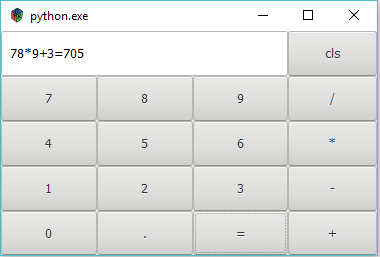

# pygobject-calculator

This is a simple pygobject calculator demo

### how to run

1. git clone https://github.com/liudonghua123/pygobject-calculator.git
2. install requirements, see details on https://pygobject.readthedocs.io/en/latest/getting_started.html
3. run with`python calculator1.py` or `python calculator2.py`

### what is this

This is just for teaching purpose, `calculator1.py` is a plain widgets created by code, and `calculator2.py` is a rewrite work which using `glade`.

### some snapshot

### license

MIT
