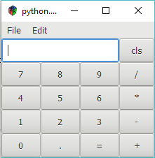

# pygobject-calculator

This is a simple pygobject calculator demo

### How to run

1. git clone https://github.com/liudonghua123/pygobject-calculator.git
2. install requirements, see details on https://pygobject.readthedocs.io/en/latest/getting_started.html
3. run with`python calculator1.py` or `python calculator2.py`

### What is this

This is just for teaching purpose, `calculator1.py` is a plain widgets created by code, and `calculator2.py` is a rewrite work which using `glade`.

### Some snapshot

### Reference

- [https://pygobject.readthedocs.io/en/latest/getting_started.html](https://pygobject.readthedocs.io/en/latest/getting_started.html)
- [https://python-gtk-3-tutorial.readthedocs.io/en/latest/introduction.html](https://python-gtk-3-tutorial.readthedocs.io/en/latest/introduction.html)
- [https://python-gtk-3-tutorial.readthedocs.io/en/latest/layout.html#grid](https://python-gtk-3-tutorial.readthedocs.io/en/latest/layout.html#grid)
- [https://lazka.github.io/pgi-docs/Gtk-3.0/classes.html](https://lazka.github.io/pgi-docs/Gtk-3.0/classes.html)
- [https://python-gtk-3-tutorial.readthedocs.io/en/latest/builder.html](https://python-gtk-3-tutorial.readthedocs.io/en/latest/builder.html)

### License

MIT
